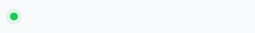
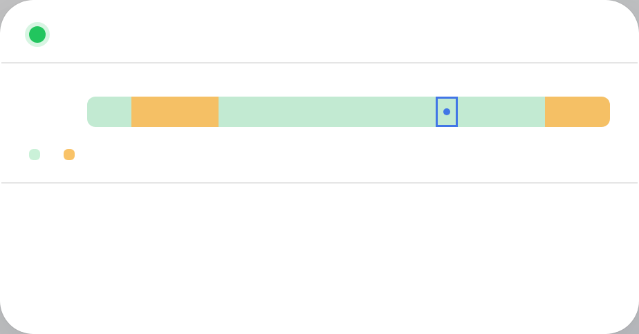

# dsh-peak-status

A DeepSeek peak/off-peak rate clock for the [DeepSeek Harness](https://github.com/deepseek-ai/deepseek-harness) web GUI.

DeepSeek bills tokens at half price outside its fixed UTC peak windows. This plugin puts a live status widget in the sidebar footer — always visible, one click away from the full picture.

## Features

- **Mini status widget** in the sidebar footer (above the Settings button)
  - Colored dot: green = off-peak (soft pulse), amber = peak
  - Status word + compact countdown to the next rate change (`4h 38m`)
  - Shrinks to a dot-only button when the sidebar is collapsed to its rail
  - Tooltip on hover with status + remaining time
- **Detail modal** (click the widget)
  - Status hero with a full `HH:MM:SS` countdown and the next change in your local time
  - 24-hour window timeline: peak windows shaded in **your local timezone**, with a marker on the current hour
  - Off-peak vs peak rate table for DeepSeek V4 Flash and V4 Pro (per 1M tokens)
  - Link to the official pricing page
- **DST-safe** — the timeline probes real local hours, so it follows daylight-saving transitions exactly:
  - skipped (spring-forward) hours are hatched and marked "does not exist"
  - repeated (fall-back) hours render as two half-cells with each occurrence's true rate
  - a "DST transition today" note appears when relevant
- **Localized** — English and Simplified Chinese dictionaries, follows the GUI's active locale
- **Theme-aware** — styled with DSH design tokens, adapts to light/dark mode

## Rate schedule

Fixed in UTC; everything outside the windows bills at the off-peak rate (50% of peak):

| Window (UTC) | Rate |
|---|---|
| 01:00 – 04:00 | **peak** |
| 06:00 – 10:00 | **peak** |
| everything else | off-peak |

Rates (per 1M tokens; input is cache-miss price):

| Model | Off-peak | Peak |
|---|---|---|
| DeepSeek V4 Flash | in $0.22 / out $0.66 | in $0.44 / out $1.32 |
| DeepSeek V4 Pro | in $0.66 / out $1.98 | in $1.32 / out $3.96 |

Rates and windows are baked into the plugin (`lib/client.js`, `PEAK_WINDOWS` / `RATES`) and versioned with the package — bump them when DeepSeek changes pricing. Rates are from the [official pricing page](https://api-docs.deepseek.com/quick_start/pricing).

## Screenshots

| Sidebar widget | Detail modal |
|---|---|
|  |  |

## Installation

This is a client plugin for a dsh profile. It ships a no-op host half and a browser half; the browser half does all the work.

1. **Link the package** into your profile. Add it to the profile's `package.json` dependencies:

   ```json
   "dependencies": {
     "dsh-peak-status": "link:/absolute/path/to/dsh-peak-status"
   }
   ```

   Then install: `pnpm install` (from the profile directory).

2. **Register the plugin** in the profile's `cordis.patch.yml`:

   ```yaml
   - insert:
       - id: peak-status
         name: 'dsh-peak-status'
   ```

   The patch is watched at runtime — the plugin activates without a server restart.

3. **Refresh the browser tab** on your dsh web GUI. The widget appears in the sidebar footer above the Settings button.

## How it works

The plugin registers a React component into the `sidebar.footer.action` slot (a list-kind slot rendered in the sidebar's foot area, above settings). The widget keeps a 1-second clock; the modal re-renders from the same tick. All time math is done on UTC epoch values, so the countdown is immune to local timezone quirks; the timeline converts window boundaries to local time by probing a real `Date` per local hour, which keeps DST transitions exact.

## Development

```
lib/
  index.js    # no-op host half (loadable entry)
  client.js   # browser half: widget, modal, clock logic, CSS, locales
docs/         # screenshots
```

Edit `lib/client.js`, then reload the page — dsh's client-module watcher serves the rebuilt bundle (`/plugins/dsh-peak-status/client.js?rev=…`) automatically.

## License

[MIT](LICENSE)
